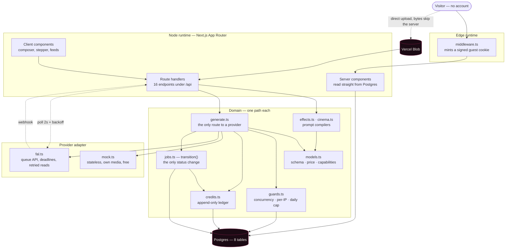
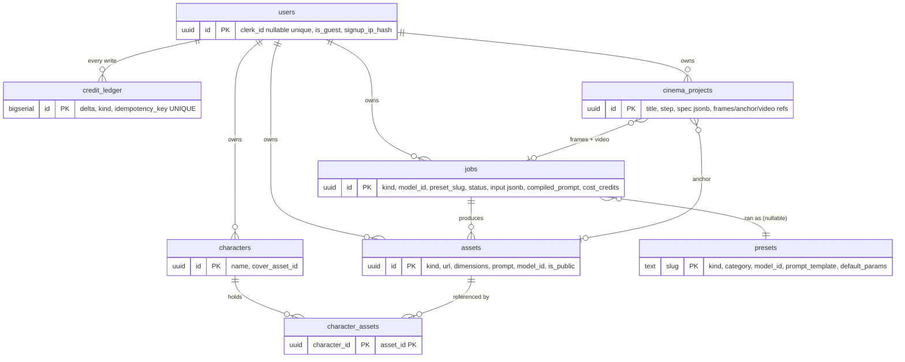
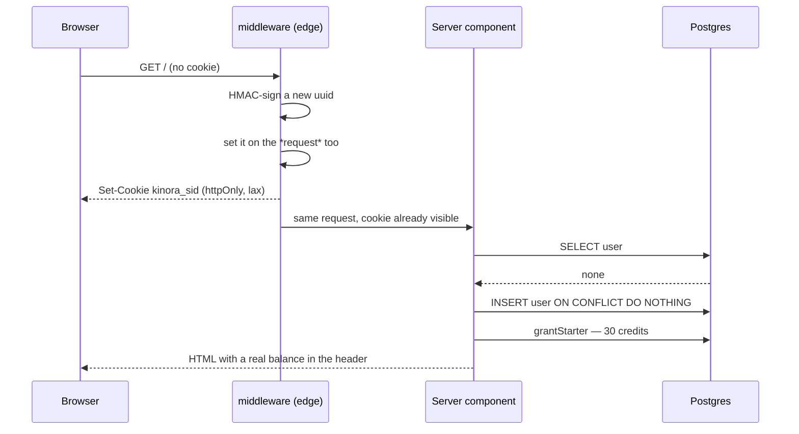
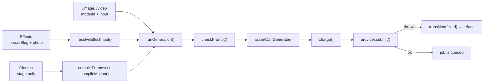
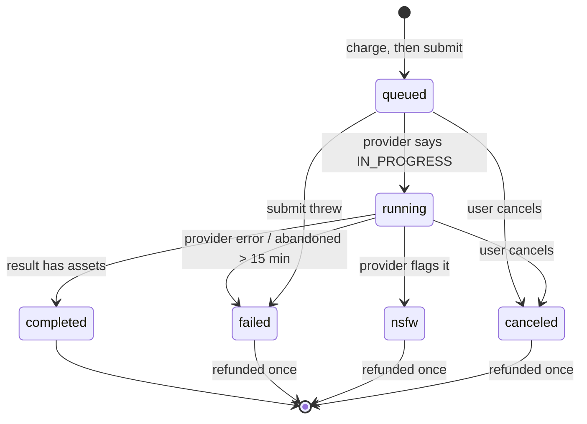

# Kinora — Architecture

How the repository is put together, why it is shaped this way, and where to
change things. [README.md](README.md) is the product tour; this is the map.

---

## 1. The shape of it

Kinora is a single Next.js App Router application. There is no separate API
service, no queue worker and no cron. Everything runs in request handlers
against one Postgres database, with generation pushed onto the provider's own
queue and reconciled by polling or a webhook.



### Three invariants

Everything else is detail. These three are what keep the app honest, and each
one is a single place in the code:

1. **`src/lib/models.ts` is the only description of a model.** Its zod schema is
   the validator, its `credits()` is the price, its `fields` build the form and
   its `capabilities` decide what a character can attach to. Adding a model is
   one object literal.
2. **`src/lib/generate.ts` is the only route to a provider.** Safety → capacity
   → charge → submit → refund-on-failure exists once. The composer, Effects and
   Cinema all call it. Three copies would be three chances to charge without
   submitting.
3. **`transition()` in `src/lib/jobs.ts` is the only way a job changes status.**
   It claims the change with `UPDATE … WHERE status IN ('queued','running')
RETURNING`, so of the poller, the webhook, the cancel route and the stuck-job
   sweep, exactly one wins. Assets are saved once; credits come back once.

---

## 2. Directory map

| Path              | Lines  | What lives there                                                                                                  |
| ----------------- | ------ | ----------------------------------------------------------------------------------------------------------------- |
| `src/app/`        | ~2,300 | Routes: 10 pages, 16 API handlers, layout, loading/error/not-found, icons, OG image                               |
| `src/components/` | ~4,700 | `studio/`, `effects/`, `cinema/`, `explore/`, `characters/`, `credits/`, `library/`, plus `ui/` shadcn primitives |
| `src/lib/`        | ~3,800 | The domain. Registry, compilers, credits, guards, jobs, providers, queries                                        |
| `src/db/`         | ~310   | Drizzle schema and the dual-driver connection                                                                     |
| `src/hooks/`      | ~220   | `use-job-queue` (polling) and `use-finish-alerts` (tab title)                                                     |
| `src/data/`       | —      | `cinema.json` — the director's-panel catalogue                                                                    |
| `tests/`          | ~1,200 | Vitest: pure logic plus a real Postgres                                                                           |
| `scripts/`        | ~560   | `seed-presets.ts` (effects), `seed-demo.ts` (Explore seed set)                                                    |
| `drizzle/`        | —      | Four generated migrations                                                                                         |

### Which module owns what

| Module                   | Owns                                                             |
| ------------------------ | ---------------------------------------------------------------- |
| `models.ts`              | The registry. Validation, pricing, form fields, capability flags |
| `generate.ts`            | The pipeline from a compiled call to a running job               |
| `jobs.ts`                | `transition()`, terminal-state rules, the stuck-job sweep        |
| `credits.ts`             | The ledger: charge, refund, grants, demo plans                   |
| `guards.ts`              | Concurrency, per-IP guest limits, the global daily cap           |
| `effects.ts`             | Effect definitions and the preset prompt compiler                |
| `cinema.ts`              | The director's-panel catalogue loader and prompt compiler        |
| `characters.ts`          | Reference capacity per model and the honest attach notice        |
| `providers/`             | The adapter interface and its two implementations                |
| `queries.ts`             | Read paths for the library, Explore, characters and studios      |
| `session.ts` / `auth.ts` | Cookie signing; lazy user creation                               |
| `retry.ts`               | Deadlines and backoff for anything crossing the network          |

---

## 3. Data model

Eight tables, uuid primary keys, `timestamptz`, snake_case columns.



### The ledger is the balance

There is no `balance` column anywhere. A balance is `SUM(delta)` over
`credit_ledger`, which is append-only. That is a deliberate trade — one extra
aggregate per read — in exchange for an invariant that cannot drift: replaying
the ledger and reading the balance can never disagree.

Every write carries an idempotency key, unique across the table:

| Key                                   | Written when                             |
| ------------------------------------- | ---------------------------------------- |
| `grant:<user>:starter`                | First visit — 30 credits                 |
| `daily:<user>:<YYYY-MM-DD>`           | The daily claim — 15 credits             |
| `job:<id>:charge`                     | Before a provider ever sees the request  |
| `job:<id>:refund`                     | Failure, refusal, cancel, or abandonment |
| `purchase:<user>:<plan>:<YYYY-MM-DD>` | A demo top-up                            |

`charge()` also takes `SELECT … FOR UPDATE` on the user row, which serialises
concurrent charges so two parallel renders cannot both read the same balance and
both decide they can afford it. A test drives four concurrent charges against a
balance that covers three and asserts the fourth is refused with the balance at
exactly zero.

### Indexes that exist for a reason

| Index                                                         | Why                                                                               |
| ------------------------------------------------------------- | --------------------------------------------------------------------------------- |
| `credit_ledger_idempotency_key_idx` (unique)                  | Makes every retry safe at the database level, not just in code                    |
| `jobs_active_idx` — partial, `status IN ('queued','running')` | The poller and the sweep only ever ask for unfinished work; keeps that index tiny |
| `assets_public_created_idx` — partial, `WHERE is_public`      | Explore reads a small slice of a large table                                      |
| `jobs_user_created_idx`, `assets_user_created_idx`            | Studio rehydration and library paging, newest first                               |
| `users_signup_ip_created_idx`                                 | The per-network guest limit                                                       |

### Two drivers, one API

`src/db/index.ts` picks the driver from `DATABASE_URL`. A `neon.tech` host uses
the serverless **WebSocket** driver — not the HTTP one, because the ledger needs
real interactive transactions (`SELECT … FOR UPDATE`), which HTTP cannot do. Any
other Postgres URL uses node-postgres, so the test suite and CI run against a
local server unchanged.

---

## 4. Identity: guest-first



Two decisions worth knowing:

- **Middleware sets the cookie on the request, not only the response.** Without
  that, the very first render would not see a session and the header would show
  a dash until a second navigation.
- **The user row is created lazily in `getCurrentUser()`, not in middleware.**
  The edge runtime cannot hold a pooled Postgres connection, and writing on
  every navigation would be wasteful.

`getCurrentUser()` reads the cookie _before_ anything else, which is what marks
a render dynamic. Skip that and Next prerenders the layout and the credit pill
freezes at build time.

`sessionCookieOptions(isHttps)` takes the protocol from `x-forwarded-proto`
rather than `NODE_ENV`. A production build served over http once handed out a
`Secure` cookie the browser never returned, so every request minted a new guest
— a bug that reads as "my credits keep resetting" with nothing in the logs.

---

## 5. Generation

### One pipeline, three entrances



Effects and Cinema send **no model, no params, no prompt and no price**. The
server recompiles all of it from the stored preset row or cinema project. The
API test suite proves this by submitting `modelId: ltx-t2v, duration: 20,
resolution: 2160p, prompt: "draw a duck"` alongside a valid effect request and
asserting the job still ran `ltx-i2v` at 6s/1080p for 20 credits with the
preset's own prompt.

### Status, and who is allowed to change it



Four callers race toward these transitions — the 2-second poller, the fal
webhook, the cancel route and the stuck-job sweep. All four go through
`transition()`, which claims the change in a single conditional `UPDATE`. The
loser reads the current row and returns it.

The refund guard is narrower than it looks:

```ts
if (isTerminal(next.status) && next.status !== "completed" && updated.costCredits > 0)
```

An earlier version omitted `isTerminal`, so moving a job to `running` refunded
it mid-render and the render then completed for free. The regression test fails
without that guard.

### Providers

`GenerationProvider` is four methods: `submit`, `status`, `result`, `cancel`.

**mock** is stateless by design. Everything `status()` and `result()` need is
encoded in the request id as `mock:<base64url json>` — mode, start time, count,
kind, aspect, size, preset — so it behaves identically across serverless
invocations where a module-level map would not survive. It supports every model
in the registry, and a test asserts that. Prompt directives `[[fail]]`,
`[[nsfw]]` and `[[slow]]` drive the paths that are otherwise hard to reach.

**fal** uses the queue API. Every call has a deadline. Reads (`status`,
`result`, `cancel`) retry with jittered exponential backoff; **`submit` never
retries** — a request that reached fal before the connection dropped would be
queued twice, which is a render nobody asked for and a bill nobody agreed to.

`status()` separates two things that look the same and are not:

| Outcome           | Meaning                                         | What happens                               |
| ----------------- | ----------------------------------------------- | ------------------------------------------ |
| `failed` / `nsfw` | fal gave us a verdict                           | Job ends, credits refunded                 |
| `unknown`         | We could not ask — timeout, 5xx, dropped socket | **Job untouched**; the sweep decides later |

Collapsing those two destroyed a still-running render every time the network
hiccuped. Credits came back; the work did not.

### The stuck-job sweep

No cron. A demo that depends on a scheduler has one more thing that can be
quietly not running. `sweepOpportunistically()` rides on the two busiest paths —
job reads and new generations — throttled to once a minute per instance, and
costs one query against the partial active-jobs index. Anything active for more
than 15 minutes is failed through `transition()`, which refunds it exactly once.

---

## 6. Prompt compilation

Two compilers, both pure, both unit-tested, neither touching the database, the
network or the clock.

**`effects.ts`** fills `{{subject}}` and `{{extra}}` in a preset's template,
then collapses whitespace and repairs punctuation — an empty `{{extra}}` must
not leave a dangling space, because the compiled prompt is shown back to the
user in the "How this was made" drawer.

**`cinema.ts`** reads `src/data/cinema.json` — 5 cameras, 6 lenses, 5 focal
lengths, 3 apertures, 6 genres, 6 lighting setups, 10 camera moves — each
carrying the prompt fragment it contributes. Adding a lens is a data edit.

The frame prompt takes the whole rig, because the still is where the look is
fixed. The motion prompt leads with the move and **drops aperture and lighting**,
which the anchor frame has already decided; repeating them only gives the video
model something to argue with.

The scene cap is derived, not guessed:

```ts
const WORST_CASE_RIG = RIG_SLOTS.reduce(
  (t, s) => t + Math.max(...CINEMA[s.group].map((o) => o.fragment.length + 2)),
  0,
);
export const SCENE_MAX = MAX_PROMPT - WORST_CASE_RIG - 8;
```

A wordier lens tightens the scene cap automatically, so a valid spec provably
cannot compile past what the model accepts — and is never silently truncated. A
test asserts the longest allowed scene survives whole _and_ keeps every rig
fragment.

A saved project reads through a tolerant schema (`readDraft`) where every field
falls back rather than throwing, so retiring a lens leaves old sequences
openable with that one slot reset instead of unopenable.

---

## 7. Endpoints

All handlers are `runtime = "nodejs"`, `dynamic = "force-dynamic"`. Every
`[id]` route validates the uuid first, so a malformed URL is a 404 rather than a
Postgres error surfacing as a 500.

| Endpoint                  | Methods            | Notes                                                                      |
| ------------------------- | ------------------ | -------------------------------------------------------------------------- |
| `/api/health`             | GET                | Open. DB, provider, spend vs cap, stuck count. Says nothing about any user |
| `/api/explore`            | GET                | Public feed. `filter=all\|image\|video\|effect`, cursor paging             |
| `/api/credits`            | GET, POST          | Balance + what is claimable; `claim` and `purchase` are idempotent per day |
| `/api/generate`           | POST               | Two body shapes: composer, or `{presetSlug, imageUrl, extra?}`             |
| `/api/jobs/[id]`          | GET                | Reconciles with the provider while active; runs the sweep                  |
| `/api/jobs/[id]/cancel`   | POST               | 409 if already terminal — never a second refund                            |
| `/api/assets`             | GET, POST          | Library page; POST records a Blob upload (Blob URLs only)                  |
| `/api/assets/[id]`        | PATCH, DELETE      | Publish toggle and delete, scoped to the owner in the WHERE clause         |
| `/api/characters`         | GET, POST          | 3–10 photos, matched against assets the caller owns                        |
| `/api/characters/[id]`    | DELETE             | Removes the character; the stills stay in the library                      |
| `/api/cinema`             | POST               | Creates a sequence. Empty body allowed, malformed body refused             |
| `/api/cinema/[id]`        | GET, PATCH, DELETE | Autosave target; `step` only moves forward                                 |
| `/api/cinema/[id]/render` | POST               | Takes a stage and nothing else                                             |
| `/api/uploads`            | POST               | Mints a scoped Blob token; bytes never touch the function                  |
| `/api/webhooks/fal`       | POST               | ED25519 verified against JWKS; idempotent                                  |
| `/api/mock/media/[name]`  | GET                | Deterministic SVG stills for the mock provider                             |

Ownership is enforced **inside the WHERE clause**, not by a check-then-act read,
so there is no window in which another user's row could be written.

---

## 8. Client patterns

**`use-job-queue`** starts from server-rendered jobs, so a refresh mid-render
resumes the same queue. It polls active ids at 2s with ×1.25 backoff capped at
10s, snapping back to 2s on any change: a fast render still feels immediate
without hammering the server during a slow one. `onFinished` fires only on the
active→terminal edge.

**The registry cannot cross the server/client boundary** — it holds zod schemas
and functions. Server components pass `ModelId[]`; the client imports `MODELS`
itself. This is why `Studio` takes `modelIds` rather than models.

**Optimistic UI always has a rollback.** Delete, publish and the character list
apply immediately and restore the previous state if the server disagrees, and a
`requestRef` token means a slow response cannot overwrite a newer filter.

**Cinema persists to the database, not the tab.** Autosave is debounced at
700ms; the project row is created on the first real edit, not on a page view, so
browsing `/cinema` leaves no trail of empty sequences. The saved `step` is a
high-water mark — stepping back to re-read the rig must not throw away four
rendered frames — and only an explicit re-render rewinds it.

---

## 8b. The visual system

[DESIGN.md](DESIGN.md) is the source of truth for how Kinora looks, adapted
from the Runway analysis in VoltAgent/awesome-design-md. It is a document an
agent reads, not a stylesheet — the tokens that implement it live in two files:

| File | Holds |
| --- | --- |
| `src/app/globals.css` | Colour tokens, the `.surface` and `.eyebrow` primitives, reduced-motion and focus rules |
| `tailwind.config.ts` | Type scale, radii, container width, the weight-450 step |

The rules that actually shape the interface:

- **Pure black canvas, one surface step, one hairline.** `#000` → `#1a1a1a` →
  `#292929` for selected state, with `#27272a` as the only border colour.
- **Zero shadows.** In cinema depth comes from lighting and composition, not
  drop shadows. Containment is a hairline and a surface step, nothing else.
- **Nothing is pill-shaped.** 4px on buttons, 8px on containers. The only
  `rounded-full` left in the codebase is a status dot, which is a real circle.
- **Negative tracking is the default**, even on body text, and display sizes sit
  at line-height 1.0. That compression *is* the editorial feel.
- **Uppercase micro labels at weight 450** with positive tracking — the
  intermediate weight is the precision detail the system calls out.
- **The media is the UI.** The hero is a full-bleed clip; effect cards are their
  own loops; there are no decorative gradients anywhere in the interface.

Three documented deviations from the source, each with its reason in the header
of DESIGN.md: Kinora keeps its ember accent (used with Runway's discipline, not
Runway's absence), uses Inter in place of the licensed abcNormal, and is
dark-only so the light-section tokens go unused. A fourth is recorded in
`globals.css`: the specified Cool Slate `#767d88` clears WCAG AA only against
pure black and fails at 4.19:1 on the `#1a1a1a` card surface, so its lightness
is lifted 50% → 54% — same hue, same character, legible everywhere it is used.

## 9. Safety, cost and limits

| Control                | Where                         | Behaviour                                                          |
| ---------------------- | ----------------------------- | ------------------------------------------------------------------ |
| Prompt pre-check       | `safety.ts`, before any spend | Small and explicit; the provider does real moderation              |
| Concurrency            | `guards.ts`                   | 2 active renders per visitor                                       |
| New guests per network | `guards.ts`                   | 8 per UTC day, against a salted IP hash — never a raw IP           |
| Global daily cap       | `guards.ts`                   | `DAILY_CREDIT_CAP` credits per UTC day across the whole deployment |
| Prompt ceiling         | `cinema.ts`                   | Derived from the catalogue, so it cannot be exceeded               |
| Abandonment            | `jobs.ts`                     | 15 minutes, then failed and refunded                               |

When the cap is reached the app **says so and refuses the render**. It never
invents a result to hide it, and nothing is charged. `/status` shows the same
numbers to anyone who wants to check.

---

## 10. Testing

```
tests/
  credits.test.ts    ledger, concurrency, daily claim, demo top-ups
  jobs.test.ts       transition(), refund-exactly-once, terminal claims
  session.test.ts    cookie signing, the Secure-flag regression
  cinema.test.ts     the prompt compiler, the derived cap, the draft schema
  effects.test.ts    preset compilation and what a client may send
  community.test.ts  character attachment and Recreate links
  hardening.test.ts  the three limits, the sweep, timeouts and retries
  providers.test.ts  the mock drives every model in the registry
```

85 tests. Pure logic runs in milliseconds; the ledger and job suites run against
a **real Postgres**, because the properties that matter — row locks, unique
constraints, conditional updates — do not exist in a fake.

Where a guard matters, it was **mutation-checked**: the guard was deliberately
broken and the suite confirmed to fail. That is how the refund guard, the
prompt ceiling, the derived scene cap and the frames model switch earned their
tests.

Beyond `pnpm test`, the repository is verified end to end against a production
build: every endpoint with its auth, validation and ownership cases, and the
real UI driven through a browser — typing a prompt, clicking Generate, waiting
for the render, clicking Animate, stepping through Cinema, publishing to Explore
and recreating it as a second visitor.

---

## 11. Where to change things

| To do this                        | Change this                                                         |
| --------------------------------- | ------------------------------------------------------------------- |
| Add a model                       | One entry in `src/lib/models.ts`                                    |
| Add an effect                     | `EFFECTS` in `src/lib/effects.ts`, then `pnpm db:seed`              |
| Add a lens, camera or camera move | `src/data/cinema.json`                                              |
| Change what a render costs        | The `credits()` function on that registry entry                     |
| Change a limit                    | `src/lib/guards.ts`, or `DAILY_CREDIT_CAP`                          |
| Add a provider                    | Implement `GenerationProvider`, register it in `providers/index.ts` |
| Change starter or daily credits   | `STARTER_CREDITS` / `DAILY_CREDITS` in `credits.ts`                 |
| Refresh the Explore seed set      | `PROVIDER=fal pnpm seed:demo`                                       |

## 12. Known gaps

- **Sign-in is not built.** The schema carries `users.clerk_id` and `is_guest`
  for it; merging is a claim on the existing guest row, which keeps the ledger,
  library and sequences intact by construction.
- **The fal path has never executed.** The adapter is written against verified
  docs, typechecks, and is exercised through the same interface as the mock, but
  no `FAL_KEY` has been available.
- **Billing is a demo.** No payment provider is connected.
- **Characters are stored references, not training.** Out of scope by the brief.
