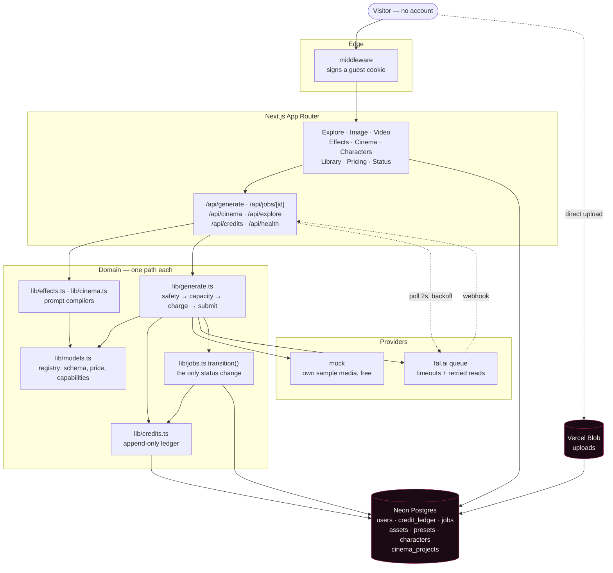

# Kinora

A creative studio for AI images and video. Explore what others made, generate your own, remix anything.

Kinora is dark, media-first and **guest-first**: the whole product works without an account. A first visit mints a session, grants credits, and every page — Explore, Image, Video, Effects, Cinema, Characters, Library — is usable immediately.

Built in 24 hours as an original product in the Higgsfield AI category. Not a clone: own name, own identity, own generated media.

## Architecture



Three rules hold the whole thing together:

1. **`lib/models.ts` is the only place a model is described.** Validation, pricing, form fields and provider ids all come from one entry, so adding a model is a single edit.
2. **`lib/generate.ts` is the only path to a provider.** Safety check → capacity guards → charge → submit → refund-on-failure exists once. The composer, Effects and Cinema all go through it.
3. **`transition()` is the only way a job changes status.** Assets are saved once, credits come back exactly once, whichever of the poller, the webhook, the cancel route or the stuck-job sweep gets there first.

## What I built, stubbed and cut

**Built**

| Area           | What is real                                                                                                                 |
| -------------- | ---------------------------------------------------------------------------------------------------------------------------- |
| Guest accounts | Signed httpOnly cookie from edge middleware; the row and its starter credits are created on the first render that needs them |
| Credit ledger  | Append-only; balance is always `SUM(delta)`. Row-lock on charge, idempotency keys throughout, refunds exactly once           |
| Model registry | Four visible models + one Cinema-only, each with a zod schema, a price function and capability flags                         |
| Async jobs     | Queue submit, 2s polling with backoff, ED25519-verified webhook, cancel, stuck-job sweep                                     |
| Image + Video  | Schema-driven composer, live cost, staged status copy, elapsed timer, rehydration after a refresh                            |
| Effects        | 8 one-photo presets as `presets` rows, compiled prompts, "How this was made"                                                 |
| Cinema         | Data-driven prompt compiler (5 cameras, 6 lenses, 5 focal lengths, 3 apertures, 10 moves), 5-step panel, saved sequences     |
| Library        | Filters, infinite scroll, delete, download, publish, Recreate                                                                |
| Explore        | Public feed with filters, infinite scroll, detail modal, Recreate, seed fallback                                             |
| Characters     | 3–10 stored reference photos, attached per model with an honest capacity notice                                              |
| Credits UI     | Cost before every submit, low/empty states, daily claim, demo plans                                                          |
| Operations     | `/api/health`, `/status`, global daily spend cap, per-IP and per-user limits                                                 |

**Stubbed, on purpose**

- **Characters are stored references, not training.** AGENTS.md puts training out of scope. Calling a folder of photos a "trained character" would misdescribe what the product does, so the UI says plainly that nothing is trained.
- **Billing is a demo.** `/pricing` writes a `purchase` row to the same ledger renders are charged against. No payment provider is connected, there is no card form, and the page says so.

**Cut, and why**

- **Agents, canvas, audio/lipsync, plugins, enterprise, mobile app** — out of scope in AGENTS.md. `generate_audio` is pinned to `false` in the registry rather than exposed.
- **Sign-in (Clerk).** It was last on the list and gated on everything above being done. It needs credentials I do not have, so I could have written the integration and never run it once — and unverifiable auth sitting in front of the one flow that must work logged-out is the wrong trade. The schema already carries `users.clerk_id` (nullable, unique) and `is_guest`; merging is a claim on the existing guest row, which keeps the ledger, library and sequences intact by construction.
- **A cron for the stuck-job sweep.** A demo that depends on a scheduler has one more thing that can be quietly not running. The sweep rides on job reads and new generations instead, throttled to one indexed query a minute per instance.

## Run it

Requires Node 20+, pnpm 10+, and Postgres. `ffmpeg` and `rsvg-convert` are only needed to regenerate the seed set.

```bash
pnpm install
cp .env.example .env.local        # defaults are fine for local dev

# point DATABASE_URL at any Postgres, then:
pnpm db:migrate                   # create the schema
pnpm db:seed                      # load the 8 effect presets

pnpm dev                          # http://localhost:3000
```

That is the whole setup. **`PROVIDER=mock` is the default and costs nothing**: generation returns Kinora's own sample media after a realistic delay, and every model in the registry is supported — a test asserts it. Three directives in a prompt drive the paths that are otherwise hard to reach:

| In a prompt | What happens                                       |
| ----------- | -------------------------------------------------- |
| `[[fail]]`  | The job fails and refunds                          |
| `[[nsfw]]`  | The provider "refuses" it and refunds              |
| `[[slow]]`  | A 20-second render, for testing cancel and refresh |

Set `PROVIDER=fal` and `FAL_KEY` to hit the real provider. Nothing else changes.

```bash
pnpm typecheck && pnpm lint && pnpm test && pnpm build
```

## Database

Postgres via Drizzle. Neon is the deployment target; any other Postgres URL (a local
server, CI) works too — the driver is picked from `DATABASE_URL`.

```bash
pnpm db:generate   # write a migration from schema changes
pnpm db:migrate    # apply migrations
pnpm db:seed       # load the effect presets (idempotent)
pnpm db:studio     # browse the data
pnpm test          # credit ledger + jobs + effects suites (needs DATABASE_URL)
```

`pnpm db:seed` is required once per environment, including production — `/effects`
reads the `presets` table, and an unseeded database shows an empty state rather
than a broken page.

Balances are never stored. `credit_ledger` is append-only and the balance is
`SUM(delta)`, so the ledger and the number on screen cannot drift apart. Every write
carries an idempotency key (`job:<id>:charge`, `job:<id>:refund`, `daily:<user>:<date>`),
and charges take a `SELECT ... FOR UPDATE` lock on the user row so concurrent renders
cannot overdraw.

## Generation

`POST /api/generate` validates against the model's zod schema, prices the job
server-side, runs a cheap safety pre-check, checks the capacity guards, charges
credits and only then submits to the provider. `GET /api/jobs/[id]` reconciles
with the provider while a job is active; `POST /api/jobs/[id]/cancel` stops one;
`POST /api/webhooks/fal` takes the provider's word once its ED25519 signature
verifies. Polling and webhooks both end in one `transition()`, which is the only
place a job changes status — so assets are saved once and credits come back
exactly once, whichever arrives first.

Video sits on the same engine: LTX-2.3 fast for image-to-video (start frame,
optional end frame for a transition) and text-to-video. Uploads go straight from
the browser to Vercel Blob and land in the library as `upload` assets.

Active jobs live in Postgres, not in the tab — a refresh mid-render rehydrates
the queue from the server, including anything that finished while the page was
closed.

Guards: 2 active jobs per user, 8 new guests per IP per day, and a global
`DAILY_CREDIT_CAP`. Hitting one returns a clear message; the product never
invents a result to cover for being out of capacity.

With `PROVIDER=mock`, prompt directives drive the paths that are otherwise hard
to reach: `[[fail]]` fails the job, `[[nsfw]]` gets it refused, `[[slow]]` takes
20 seconds. All three refund.

## Reliability and cost safety

This is a public demo with a real provider bill behind it, so the failure modes
that matter are the expensive ones.

- **Every provider call has a deadline.** Reads are retried with backoff; submit
  never is, because a request that reached fal before the connection dropped
  would be queued twice — a render nobody asked for and a bill nobody agreed to.
- **An unreachable provider is not a failed job.** `status()` distinguishes "fal
  refused this" from "we could not ask", and only the first costs the user their
  render. The second leaves the job alone.
- **Jobs stuck past 15 minutes are failed and refunded** by a sweep that runs
  opportunistically on job reads and new generations, throttled to once a minute
  per instance. No cron to forget to configure.
- **The webhook is idempotent**: signature verified, terminal jobs acknowledged
  and ignored, and it re-reads from the provider rather than trusting the body,
  so it and the poller cannot disagree about what was produced.
- **Three limits, all server-side**: 2 renders at once per visitor, 8 new guests
  per network per day, and a global `DAILY_CREDIT_CAP`. On the cap, generation
  returns a clear "demo capacity reached" — never a fake result.

`GET /api/health` reports database reachability, provider, today's spend against
the cap and the stuck-job count, and says nothing about any user, so it is safe
to leave open. `/status` is the same thing for humans.

## Effects

An effect is a `presets` row (`kind='effect'`): a title, a category, a model, a
prompt template, fixed params and one required photo slot. The definitions live in
[src/lib/effects.ts](src/lib/effects.ts) so they are reviewable in a diff, and
`pnpm db:seed` upserts them into the table the app actually reads.

`POST /api/generate` accepts two shapes. The composer sends a model and its
params; an effect sends `{ presetSlug, imageUrl, extra? }` and nothing else is
read — the model, the params, the prompt and the price all come off the preset
row, so an effect cannot be steered or underpaid from the client. The compiled
prompt is stored on the job and shown in the "How this was made" drawer.

Example loops in `public/mock/effects/` were generated here with ffmpeg. They are
reference motion, not renders of the effect itself; with `PROVIDER=mock` a run
returns its own effect's loop so the demo stays coherent.

## Explore

`/` is the public feed: assets their owner made public, newest first, filtered
by Images / Videos / Effects, with infinite scroll and a detail modal carrying
the prompt, the model and "Recreate this". Nothing about the author is shown —
a guest who shares a render has not agreed to be identified.

Recreate on someone else's work cannot reopen their job, so it prefills the
matching composer from what the feed already shows (`?prompt=` and `?model=`);
an effect render opens that effect instead. While there are fewer than eight
public renders, sample tiles pad the grid — labelled "Sample", never counted as
anyone's work.

## Characters

`/characters`: 3–10 photos under a name. Nothing is trained, per AGENTS.md —
they are stored references, and the page says so where someone would otherwise
assume a fine-tune. Selecting one in Image or Cinema attaches them to the model,
and **says what it did**: how many photos a model can take is read off the
registry's capabilities, so a model that takes one of ten, or none at all,
reports that before anything is charged rather than rendering the wrong thing.

## Credits

Cost is shown before every submit, and `CreditNotice` covers the two states that
matter: running low (under one clip) and short for this render — each ending in
something to do rather than a dead end.

The header carries the balance and, once a day, a Claim button that calls
`grantDaily`. It is a button rather than an automatic top-up: credits arriving
silently teach nobody that renders cost anything.

`/pricing` has Free / Pro / Max, all labelled demo billing. "Upgrade" writes a
`purchase` row to the same ledger every render is charged against — no payment
provider is connected, there is no card form, and the button says so. Each
top-up is keyed per plan per day, so a double-click cannot buy twice.

## Cinema

A director's panel in five steps: Scene → Rig → Frames → pick the anchor →
Motion → Result.

[src/lib/cinema.ts](src/lib/cinema.ts) is a pure compiler over
[src/data/cinema.json](src/data/cinema.json) — 5 cameras, 6 lenses, 5 focal
lengths, 3 apertures, 6 genres, 6 lighting setups and 10 camera moves, each
carrying the prompt fragment it contributes. Adding a lens is a data edit. The
frame prompt takes the whole rig, because the still is where the look is fixed;
the motion prompt leads with the move and drops aperture and lighting, which
the anchor frame has already decided. `pnpm test` covers it, including that the
compiled prompt cannot outgrow what the model accepts — the scene cap is derived
from the catalogue rather than guessed.

Camera and lens options describe the look of a medium (grain, latitude, flare,
bokeh shape) rather than naming a manufacturer's product.

Frames are four widescreen candidates from one job. With no references that is
the cheap four-step model (4 credits); attach up to four reference images, or a
saved Character, and it switches to the multi-reference model, which costs what
it costs (48 credits for four). The panel shows the live price either way.

Every step is written to `cinema_projects` as you go — panel state, the frames
job, the anchor you picked and the clip. `/cinema` resumes the most recent
sequence, `?p=<id>` opens a specific one and `?new=1` starts a blank panel. The
saved step is a high-water mark, so stepping back to re-read the rig never
loses four rendered frames. `POST /api/cinema/[id]/render` takes a stage and
nothing else: the scene, rig, model, prompt and price are all recompiled from
the saved row.

Characters are reference images under a name — no training, per the brief. They
exist so a sequence can be pointed at the same person again without hunting
through the library.

## Sessions

Guest-first. Middleware issues a signed, httpOnly cookie on the first request;
`getCurrentUser()` creates the user row and its 30 starter credits on the first server
render that needs them. `users.clerk_id` is reserved for real accounts later.

## Scripts

| Command          | What it does                    |
| ---------------- | ------------------------------- |
| `pnpm dev`       | Dev server                      |
| `pnpm build`     | Production build                |
| `pnpm start`     | Serve the production build      |
| `pnpm typecheck` | `tsc --noEmit`                  |
| `pnpm lint`      | ESLint (Next config + Prettier) |
| `pnpm format`    | Prettier write                  |
| `pnpm db:seed`   | Load the effect presets         |
| `pnpm seed:demo` | Render the Explore seed set     |

Run `pnpm typecheck && pnpm lint && pnpm build` before every commit.

## Routes

| Route             | What's there                                  |
| ----------------- | --------------------------------------------- |
| `/`               | Explore: public feed, filters, detail modal   |
| `/image`          | Image composer + recent renders               |
| `/video`          | Video composer + recent renders               |
| `/effects`        | Eight one-photo effects, filtered by category |
| `/effects/[slug]` | Example, photo slot, inline job, result       |
| `/cinema`         | Director's panel: scene, rig, frames, motion  |
| `/characters`     | 3–10 stored reference photos under a name     |
| `/library`        | Your renders (loading / empty / error states) |
| `/pricing`        | Free / Pro / Max — demo billing, no payments  |
| `/status`         | Today's spend against the cap, limits, health |

## Structure

```
src/
  app/            routes, API handlers, layout, loading/error/not-found
  components/     app shell, studio, effects, cinema, explore, characters, credits
  components/ui   shadcn primitives (button, badge, dialog, skeleton, toast…)
  data/           cinema.json — the director's panel catalogue
  db/             Drizzle schema and the dual-driver connection
  lib/            models, generate, jobs, credits, guards, providers, compilers
  hooks/          job queue polling, tab-title alerts
scripts/          seed-presets.ts (effects), seed-demo.ts (Explore seed set)
tests/            vitest — pure logic and a real Postgres
drizzle/          generated migrations
```

## Environment

Copy [.env.example](.env.example) to `.env.local`. Never commit `.env*` files.

| Variable                | Required   | What it does                                                                                                                                                                                     |
| ----------------------- | ---------- | ------------------------------------------------------------------------------------------------------------------------------------------------------------------------------------------------ |
| `DATABASE_URL`          | yes        | Postgres connection string. A `neon.tech` host uses the WebSocket driver (the credit ledger needs real transactions); anything else uses node-postgres, so a local server or CI works unchanged. |
| `SESSION_SECRET`        | yes        | Signs the guest session cookie. `openssl rand -base64 32`.                                                                                                                                       |
| `PROVIDER`              | no         | `mock` (default) or `fal`. Mock costs nothing and supports every model.                                                                                                                          |
| `FAL_KEY`               | with `fal` | fal.ai credentials. Unset means mock, so a missing key never spends money.                                                                                                                       |
| `NEXT_PUBLIC_APP_URL`   | production | Absolute base URL. Also decides whether fal gets a webhook — localhost cannot receive one, so development just polls.                                                                            |
| `BLOB_READ_WRITE_TOKEN` | no         | Vercel Blob uploads. Without it, upload fields degrade to "paste an image URL instead" with a clear message.                                                                                     |
| `DAILY_CREDIT_CAP`      | no         | Global ceiling on credits the demo may spend per UTC day. Defaults to 5000.                                                                                                                      |

## Seed set

Explore is a community feed, and an empty community feed reads as broken rather
than new. [`scripts/seed-demo.ts`](scripts/seed-demo.ts) renders ~20 curated
prompts once, transcodes them into `public/seed/` (webp stills, clips capped at
6 seconds and 3MB) and writes [`src/lib/seed.ts`](src/lib/seed.ts). Those tiles
pad the grid until there are eight real public renders, labelled **Sample** and
never counted as anyone's work.

```bash
PROVIDER=mock pnpm seed:demo   # free, Kinora's own sample media
PROVIDER=fal  pnpm seed:demo   # real renders, real money, run once
```

The output is committed, so the deployed site never depends on this having run.

## Deploy

Vercel, importing this repo. Build command `pnpm build`; the Next.js preset
handles the rest.

1. Set the environment variables from the table above. `DATABASE_URL` and
   `SESSION_SECRET` are the only two that are not optional. Start with
   `PROVIDER=mock`.
2. Run `pnpm db:migrate && pnpm db:seed` against the production database once.
   Without the seed the app works but `/effects` is empty.
3. Open `/api/health` — it should report `ok: true` and a reachable database.
4. Switch `PROVIDER=fal` and add `FAL_KEY` when you want real renders. Set
   `NEXT_PUBLIC_APP_URL` to the https origin so fal gets a webhook instead of
   being polled.

Check the deployment in a logged-out incognito window: Explore should render,
the credit pill should show a number, and a render should complete.
